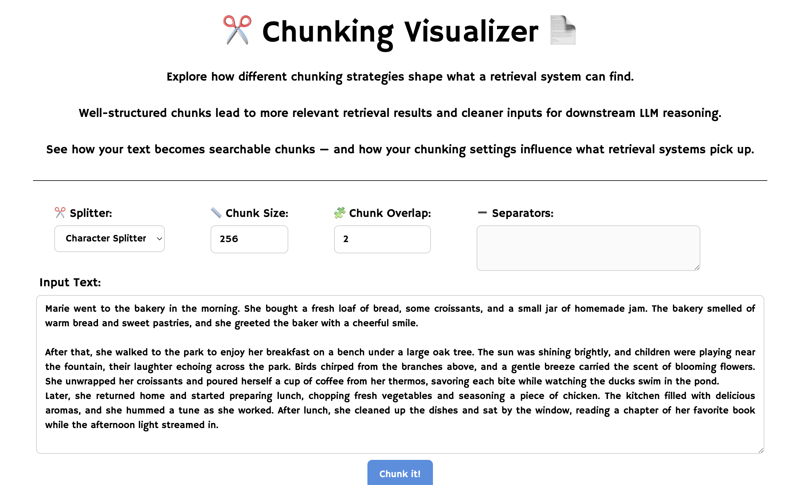

# Chunking-Vis
A tool for visualizing different text-chunking methods.



## Features

### Chunking Methods
Currently supported splitters:
- Character-level chunking  
- Word-level chunking  
- Token-level chunking (based on the GPT-4o tokenizer)  
- Recursive chunking  
- Semantic chunking  
- Agentic chunking (powered by the Phi-3 LLM)

### Snapshots
Save the current chunking state and compare different chunking configurations side-by-side.

## Demo
A live demo is available at:  **[Chunking-Vis](https://chunkingvis-production.up.railway.app)**  

Due to resource limitations, agentic chunking is disabled in the demo.

## Installation

### Docker
```bash
docker buildx build -t chunking_vis:latest .
docker run -p 8000:8000 --rm chunking_vis:latest
```

### Python 
1. Install uv:
```bash
curl -LsSf https://astral.sh/uv/install.sh | sh
```

2. Install dependencies
```bash
uv sync
```

3. Setup Django
```bash
uv run python manage.py migrate
```

4. Start the app
```bash
uv run python manage.py runserver localhost:8000
```

## Requirements
- Python 3.10+  
- uv package manager  
- Docker (optional)  

## Tech Stack
- **Backend:** Django  
- **Frontend:** HTMX + Tailwind
- **LLMs:** GPT-4o tokenizer, Phi-3 for agentic chunking  
- **Deployment:** Railway

## Contributing
Contributions are welcome!  
Please open an issue or submit a pull request on GitHub.

## Contact
For reporting problems, please create an Issue on the GitHub page.